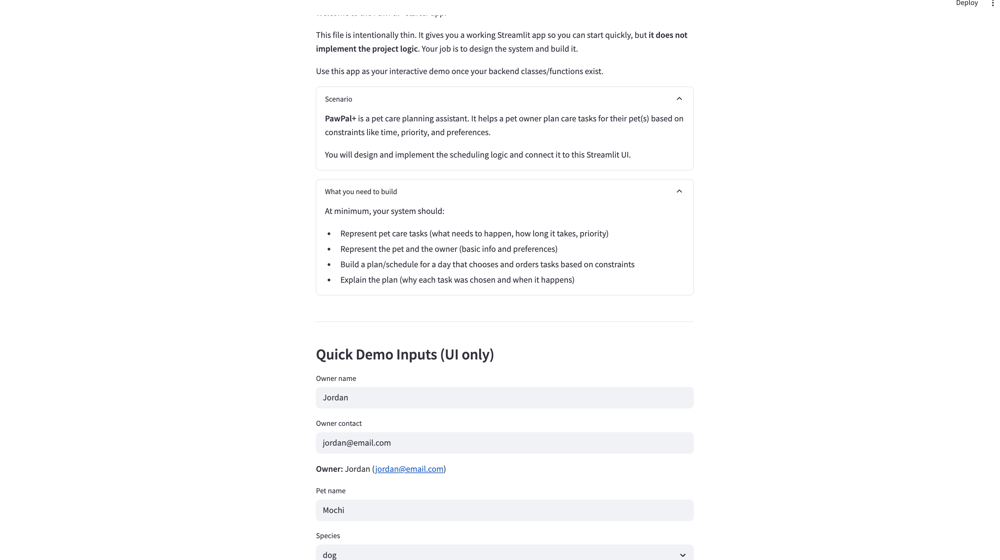

# 🐾 PawPal+

A smart pet care management app that helps owners 
track and schedule daily pet care tasks.

## Scenario

A busy pet owner needs help staying consistent with 
pet care. They want an assistant that can:

- Track pet care tasks (walks, feeding, meds, 
  enrichment, grooming, etc.)
- Consider constraints (time available, priority, 
  owner preferences)
- Produce a daily plan and explain why it chose 
  that plan

## 📸 Demo



## ✨ Features

- **Add pets and tasks** - Enter owner and pet info 
  and add care tasks with duration and priority
- **Sort by time** - Tasks automatically sorted 
  chronologically with stable secondary sorting 
  by pet name
- **Filter tasks** - Filter by pet name, priority 
  level, or completion status
- **Conflict detection** - Warns when two tasks are 
  scheduled at the same time with a clear message
- **Recurring tasks** - Daily and weekly tasks 
  auto-reschedule when marked complete
- **Priority indicators** - 🔴 High 🟡 Medium 🟢 Low

## 🧠 Smarter Scheduling

PawPal+ uses algorithmic logic to:

- Sort tasks chronologically with stable secondary 
  sorting by pet name and task name
- Detect exact time conflicts and display warnings
- Create new task instances for recurring tasks 
  after completion
- Filter tasks by pet name, status, or priority

## 🚀 Setup
```bash
python -m venv .venv
source .venv/bin/activate
pip install -r requirements.txt
streamlit run app.py
```

## 🧪 Testing PawPal+

Run the test suite:
```bash
python -m pytest
```

Tests cover:
- Task completion status changes correctly
- Adding tasks increases pet task count
- Tasks sort in chronological order
- Daily tasks reschedule after completion
- Conflict detection flags duplicate times

**Confidence Level: ⭐⭐⭐⭐ (4/5 stars)**

## 📁 Project Structure

- `pawpal_system.py` - Core backend classes
- `app.py` - Streamlit UI
- `main.py` - CLI demo script
- `tests/test_pawpal.py` - Automated tests
- `reflection.md` - Project reflection
- `uml_final.png` - Final system architecture diagram

## Suggested Workflow

1. Read the scenario and identify requirements
2. Draft a UML diagram
3. Convert UML into Python class stubs
4. Implement scheduling logic in small increments
5. Add tests to verify key behaviors
6. Connect logic to Streamlit UI in app.py
7. Refine UML to match final implementation